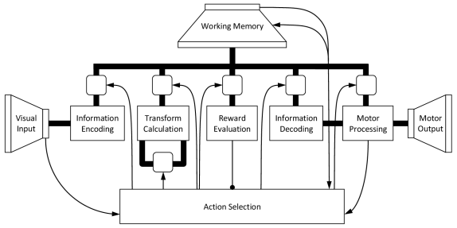

Introduction to the Semantic Pointer Architecture
-------------------------------------------------

Briefly, the Semantic Pointer hypothesis states:

    Higher-level cognitive functions in biological systems are made possible by
    Semantic Pointers. Semantic Pointers are neural representations that carry
    partial semantic content and are composable into the representational
    structures necessary to support complex cognition.

The term ‘Semantic Pointer’ was chosen because the representations in the
architecture are like ‘pointers’ in computer science (insofar as they can be
‘dereferenced’ to access large amounts of information which they do not
directly carry). However, they are ‘semantic’ (unlike pointers in computer
science) because these representations capture relations in a semantic vector
space in virtue of their distances to one another, as typically envisaged by
connectionists.

The book `How to build a brain
<https://www.amazon.com/How-Build-Brain-Architecture-Architectures/dp/0199794545>`_
from Oxford University Press gives a broader introduction into the Semantic
Pointer Architecture (SPA) and its use in cognitive modeling. To describe the
architecture, the book covers four main topics that are semantics, syntax,
control, and learning and memory. The discussion of semantics considers how
Semantic Pointers are generated from information that impinges on the senses,
reproducing details of the spiking tuning curves in the visual system. Syntax is
captured by demonstrating how very large structures can be encoded, by binding
Semantic Pointers to one another. The section on control considers the role of
the basal ganglia and other structures in routing information throughout the
brain to control cognitive tasks. The section on learning and memory describes
how the SPA includes adaptability (despite this not being a focus of the `Neural
Engineering Framework <http://compneuro.uwaterloo.ca/research/nef.html>`_ used
in Nengo) showing how detailed spiking timing during learning can be
incorporated into the basal ganglia model using a biologically plausible
STDP-like rule.

Structured representations
^^^^^^^^^^^^^^^^^^^^^^^^^^

The Semantic Pointer Architecture (SPA) uses a specific type of a Vector
Symbolic Architecture. That means it uses (high-dimensional) vectors to
represent concepts. These can be combined with certain linear and non-linear
operations to bind the concept vectors and build structured representations.

The specific operations used by the SPA where first suggested by Tony A. Plate
in `Holographic Reduced Representation: Distributed Representation for Cognitive
Structures
<https://www.amazon.ca/Holographic-Reduced-Representation-Distributed-Structures-ebook/dp/B0188Y14VS/ref=sr_1_1?ie=UTF8&qid=1502311400&sr=8-1>`_
In particular, we usually use random vectors of unit-length and three basic
operations.

1. *Superposition*: Two vectors :math:`\vec{v}` and :math:`\vec{w}` can be
   combined in a union-like operation by simple addition as
   :math:`\vec{u} = \vec{v} + \vec{w}`. The resulting vector will be similar to
   both of the original vectors.
2. *Binding*: The binding has to produce a vector that is dissimilar to both of
   the original vectors and allows to recover one of the original vectors given
   the other one. In the SPA, we employ circular convolution for this purpose
   defined as

   .. math::

      \vec{u} = \vec{v} \circledast \vec{w}\ :\quad u_i = \sum_{j=1}^D v_j
      w_{(i-j)\ \mathrm{mod}\ D}

   where :math:`D` is the dimensionality of the vectors.
3. *Unbinding*: To unbind a vector from a circular convolution, another circular
   convolution with the approximate inverse of one of the vectors can be used:
   :math:`\vec{v} \approx \vec{u} \circledast \vec{w}^+`. The approximate
   inverse is given by reordering the vector components:
   :math:`\vec{w}^+ = (w_1, w_D, w_{D-1}, \dots, w_2)^T`.

Note that circular convolution is associative, commutative, and distributive:

* :math:`(\vec{u} \circledast \vec{v}) \circledast \vec{w} = \vec{u} \circledast (\vec{v} \circledast \vec{w})`,
* :math:`\vec{v} \circledast \vec{w} = \vec{w} \circledast \vec{v}`,
* :math:`\vec{u} \circledast (\vec{v} + \vec{w}) = \vec{u} \circledast \vec{v} + \vec{u} \circledast \vec{w}`.

Let us consider a simple example: Given vectors for *red*, *blue*,
*square*, and *circle*, we can represent a scene with a *red square* and *blue
circle* as

.. math::

   \vec{v} = \mathrm{Red} \circledast \mathrm{Square} + \mathrm{Blue}
   \circledast \mathrm{Circle}

If we want to know the color of the square, we can unbind the *square* vector:

.. math::

   \vec{v} \circledast \mathrm{Square}^+ = \mathrm{Red} \circledast
   \mathrm{Square} \circledast \mathrm{Square}^+ + \mathrm{Blue} \circledast
   \mathrm{Circle} \circledast \mathrm{Square}^+ \approx \mathrm{Red}
   + \mathit{noise}

An example: Spaun
^^^^^^^^^^^^^^^^^

In chapter 7 of How to build a brain, the SPA Unified Network (Spaun) model is
presented that demonstrates how a wide variety of (about 8) cognitive tasks can
be integrated in a single large-scale, spiking neuron model. Spaun switches
tasks and provides all responses without any manual change in parameters from
a programmer. Essentially, it is a fixed model that integrates perception,
cognition, and action across several different tasks. Spaun is the most complex
example of an SPA to date.

   A high-level depiction of the Spaun model, with all of the central features
   of a general Semantic Pointer Architecture. Visual and motor hierarchies
   provide semantics via connections to natural input (images) and output (a
   nonlinear dynamical arm model). Central information manipulation depends on
   syntaictic structure for several tasks. Control is largely captured by the
   basal ganglia aciton selection elements. Memory and learning take place in
   both basal ganglia and contex. The model itself consists of just under
   a million spiking neurons.

Let us consider how the model would perform a single run of one of the cognitive
tasks (`see a video of Spaun running this task
<http://nengo.ca/build-a-brain/task7>`_). This is analogous to the `Raven's
Matrix <https://en.wikipedia.org/wiki/Raven's_Progressive_Matrices>`_ task,
which requires people to figure out a pattern in the input, and apply that
pattern to new input to produce novel output. For instance given the following
input ``[1] [11] [111] [2n [22] [222] [3] [33] ?`` the expected answer is
``333``. The input to the model first indicates which task it will
perform by presenting it with an ``A`` followed by the task number (e.g. ``A 7``
for this task). Then it is shown a series of letters and brackets and it has to
draw the correct answer with its arm. The processing for such a task goes
something like this:

1. The image impacts the visual system, and the neurons transform the raw image
   input (784 dimensions) to a lower dimensional (50 dimensions) Semantic
   Pointer that preserves central visual features. This is done using a visual
   hierarchy model (i.e., V1-V2-V4-IT) that implements a learned statistical
   compression.
2. The visual Semantic Pointer is mapped to a conceptual Semantic Pointer by an
   associative memory, and stored in a working memory. Storing Semantic
   Pointers is performed by binding them to other Semantic Pointers that are
   used to encode the order the information is presented in (e.g. to
   distinguish ``1 2`` from ``2 1``).
3. In this task, the Semantic Pointers generated by consecutive sets of inputs
   are compared with each other to infer what relationship there exists (e.g.
   between ``1`` and ``11``; or ``22`` and ``222``).
4. The shared transofmation across all the input is determined by averaging the
   previously inferred relationships across all sets of inputs (so the inferred
   relationship between ``1`` and ``11`` is averaged with that between ``22``
   and ``222``, etc.).
5. When the ``?`` is encountered, Spaun determines its answer by taking the
   average relationship and applying it to the last input (i.e., ``33``) to
   generate an internal representation of the answer.
6. This representation is then used to drive the motor system to write out the
   correct answer (see :numref:`spa_2`), by sending the relevant Semantic
   Pointers to the motor system.
7. The motor system “dereferences” the semantic pointer by going down the motor
   hierarchy to generate appropriate control signals for a high-degree of
   freedom physical arm model.

.. _spa_2:

.. figure:: spa_2.png
   :alt: Example input and output from Spaun.

   Example input and output from Spaun. a) Handwritten numbers used as input.
   b) Numbers drawn by Spaun using its arm.

All of the control-like steps (e.g. “compared with”, “inferred”, and routing
information through the system), are implemented by a biologically plausible
basal ganglia model. This is one example of the 8 different tasks that Spaun is
able to perform. Videos for all tasks can be found `here
<http://nengo.ca/build-a-brain/spaunvideos/>`_.
